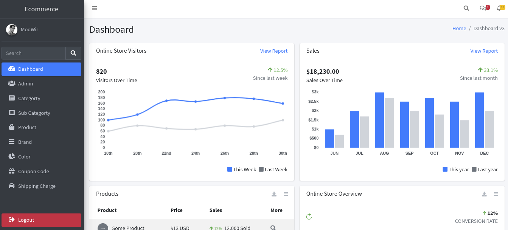
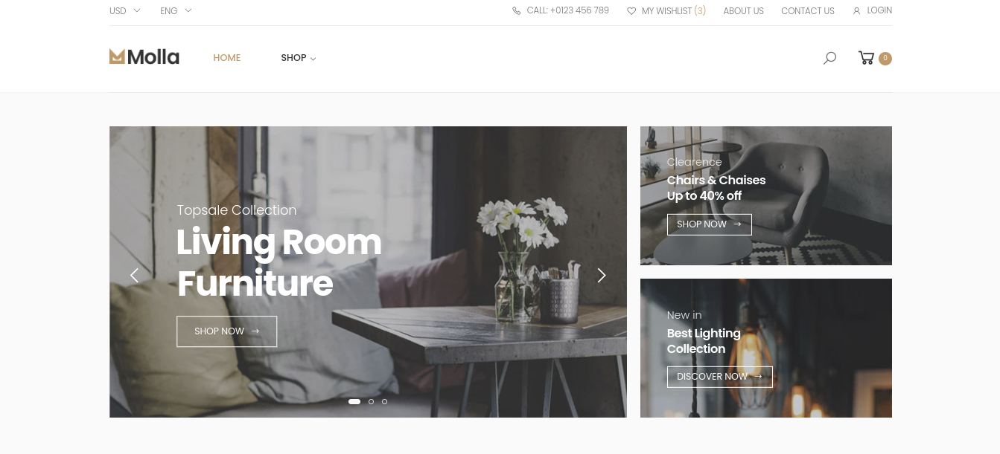

# ModWir - Group 3 Graduation Project in Ibb City - Yemen

Medical app UI Design Flutter .
# ScreenShots 
   Themes    |                                                  
:------------:                                               

  
   
  

| User Screens|                                                   
|:------------:

 

## Getting Started

# Installation: 
    Steps:
      step 1:
              git clone https://github.com/mohajuwa/medh2.git
      step 2:
              pub get
      step 3: 
              change the version of flutter in your file(pupspec.yaml)
              

## 🌐 Socials:
  

# 💻 Tech Stack:
                          
# 📊 GitHub Stats:
 
 

## 🏆 GitHub Trophies

### ✍️ Random Dev Quote

### 🔝 Top Contributed Repo

### 😂 Random Dev Meme

<!-- Proudly created with GPRM ( https://gprm.itsvg.in ) -->

